# Crypto Wallet

A Flutter-based cryptocurrency wallet app focused on the **TRON** network. It supports creating and importing hot wallets, viewing TRX and TRC‑20 token balances, and a multi-wallet UI. Cold wallet, watch wallet, and live market data are not yet implemented.

---

## Project Overview

- **Target chain:** TRON (mainnet). Balance and token data use the public [TronScan API](https://apilist.tronscanapi.com/api).
- **Platforms:** Android, iOS; desktop (e.g. Windows/macOS) via `sqflite_common_ffi`; Web has limited support (no SQLite; single-wallet storage via SharedPreferences).
- **Stack:** Flutter 3.x, Dart 3, SQLite (sqflite / sqflite_ffi), Provider, Easy Localization, `k_chart` for charts.

### Repository structure (main areas)

| Path | Description |
|------|-------------|
| `lib/main.dart` | App entry, DB init, locale/theme, `WalletCheckPage` → `WalletGuidePage` or `HomePage` (bottom nav). |
| `lib/pages/` | UI: wallet guide, create/import flows, mnemonic/backup, wallet detail, transfer/receive, token detail, market, trade, profile. |
| `lib/services/` | `DatabaseService` (wallets DB), `WalletService`, `WalletGeneratorService`, `TronScanService` (balance/tokens/market), `TronTransactionService` (sign/broadcast), `MarketService`, `ThemeService`. |
| `lib/theme/` | App theme. |
| `lib/widgets/` | Shared UI (e.g. primary button). |
| `assets/translations/` | i18n (en, zh, ja, ko, es, fr, de, ru). |
| `assets/dummy_kline_data.json` | Static K-line data used by the market tab. |

### Implemented features (current behavior)

- **Onboarding:** First launch → wallet guide; “Create” → `WalletCreateOptionsPage` (Create / Cold / Watch); “Import” → `ImportWalletPage` (Mnemonic, Private key, Cold, Watch). Only **Create Wallet** and **Mnemonic/Private key import** are fully implemented.
- **Wallets:** Create wallet (BIP39 mnemonic, name, password), display and backup mnemonic, mark as backed up. Import by mnemonic or private key. Multiple wallets stored in SQLite; switch current wallet from the home screen menu; wallet list search.
- **Assets:** Home shows total USD value and token list. TRX balance and TRC‑20 tokens (e.g. USDT) loaded via `TronScanService`; TRX price/change from TronScan market API. Pull-to-refresh.
- **Transfer / Receive:** Transfer page: address + amount input, estimated fee (currently fixed 0.01; no real fee API). Confirm button is **TODO** (no signing/broadcast). Receive: show address and QR by token.
- **Wallet detail:** View name, address, backup status; export mnemonic (with password); export private key; delete wallet (with password). Permission/whitelist/fingerprint/change password/reset password are **TODO**.
- **Token detail:** Navigate from asset list; shows price, change, quantity, USD value; links to market and transfer.
- **Market tab:** Single “TRX” market screen: price, 24h change, volume, market cap, total supply, holders. K-line chart with time intervals (1m–1w); data from **local dummy JSON** (`assets/dummy_kline_data.json`). “Depth” and “Info” tabs show “Coming soon”. Share and favorite are **TODO**.
- **Trade tab:** Swap UI (from/to token, amount fields). Trade history and settings are **TODO**; no actual swap execution.
- **Discover tab:** Placeholder (e.g. “Discover” text only).
- **Profile:** Language selection (8 locales), theme toggle (dark/light). Notifications **TODO**.
- **QR / camera:** Camera picker present; **TODO** for processing scan result and using it in transfer/import.
- **Security:** Mnemonic/private key stored in local DB; password stored with a simple hash (**TODO:** proper password hashing in `WalletService` and `DatabaseService`).

---

## Incomplete / In Progress

The following are **not implemented** or only stubbed. The README is the source of truth for “done” vs “in progress.”

### Cold Wallet

- **Status:** Not implemented.
- **Where:** “Cold Wallet” appears in **Create** flow (`lib/pages/wallet_create_options_page.dart`) and **Import** flow (`lib/pages/import_wallet_page.dart`). Tapping does nothing; code has `// TODO: Navigate to cold wallet page`.
- **Missing:** No cold-wallet creation/import flow, no offline signing flow, and no dedicated storage/UI for cold wallets.

### Watch Wallet

- **Status:** Not implemented.
- **Where:** “Watch Wallet” appears in the same Create and Import pages. Tapping does nothing; code has `// TODO: Navigate to watch wallet page`.
- **Missing:** No flow to add an address as watch-only, no read-only wallet type in DB or UI, and no integration with the asset/balance views for watch-only addresses.

### Market

- **Status:** Partially implemented; **data is not live**.
- **Where:** `lib/services/market_service.dart`, `lib/pages/market_page.dart`.
- **Current behavior:**
  - **Price / stats:** `getMarketData()` returns a **hardcoded dummy map** (`_dummyMarketData`). Real CoinGecko (or similar) fetching is commented out.
  - **K-line:** `getKLineData()` reads from **local JSON** (`assets/dummy_kline_data.json`) only. No live exchange or API K-line.
  - **Tabs:** “K-Line” tab shows the chart; “Depth” and “Info” tabs show a “Coming soon” message.
- **Missing:** Live price/volume/market cap from an external API; real K-line data source; depth chart and info tab content; optional share/favorite behavior as designed.

---

## Getting Started

### Prerequisites

- Flutter SDK
- Dart SDK
- Android Studio / VS Code with Flutter plugin

### Installation

1. Clone the repository
```bash
git clone https://github.com/yourusername/crypto-wallet.git
```

2. Install dependencies
```bash
flutter pub get
```

3. Run the app
```bash
flutter run
```

## Security Notes

- Mnemonic and private keys are stored in the local SQLite database (or SharedPreferences on Web). Ensure device security and consider future encryption of sensitive fields.
- Mnemonic generation uses the `bip39` package. Wallet creation and backup flows are implemented; user must back up the phrase offline.
- Passwords are used for wallet creation, deletion, and export; hashing is currently a placeholder (**TODO:** use a proper password hash in `WalletService` and `DatabaseService`).
- Biometric authentication is referenced in wallet detail UI but not implemented (**TODO**).

## Contributing

This is a private repository. Please contact the repository owner for contribution guidelines.

## License

This project is licensed under the MIT License.

```
MIT License

Copyright (c) 2025 crypto-wallet authors

Permission is hereby granted, free of charge, to any person obtaining a copy
of this software and associated documentation files (the "Software"), to deal
in the Software without restriction, including without limitation the rights
to use, copy, modify, merge, publish, distribute, sublicense, and/or sell
copies of the Software, and to permit persons to whom the Software is
furnished to do so, subject to the following conditions:

The above copyright notice and this permission notice shall be included in all
copies or substantial portions of the Software.

THE SOFTWARE IS PROVIDED "AS IS", WITHOUT WARRANTY OF ANY KIND, EXPRESS OR
IMPLIED, INCLUDING BUT NOT LIMITED TO THE WARRANTIES OF MERCHANTABILITY,
FITNESS FOR A PARTICULAR PURPOSE AND NONINFRINGEMENT. IN NO EVENT SHALL THE
AUTHORS OR COPYRIGHT HOLDERS BE LIABLE FOR ANY CLAIM, DAMAGES OR OTHER
LIABILITY, WHETHER IN AN ACTION OF CONTRACT, TORT OR OTHERWISE, ARISING FROM,
OUT OF OR IN CONNECTION WITH THE SOFTWARE OR THE USE OR OTHER DEALINGS IN THE
SOFTWARE.
```

## Screenshots

### App Screenshots

<div style="display: flex; flex-wrap: wrap; gap: 10px;">
  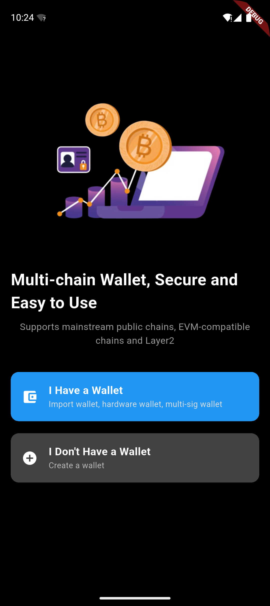
  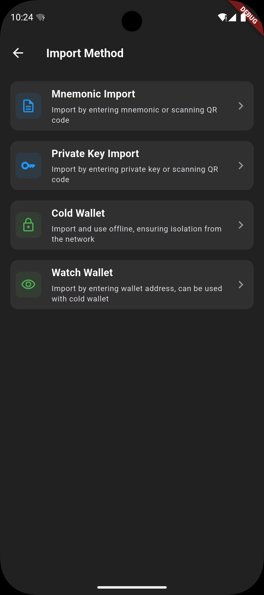
  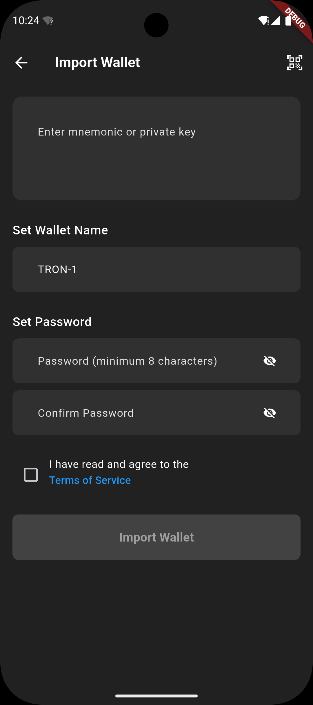
</div>

<div style="display: flex; flex-wrap: wrap; gap: 10px;">
  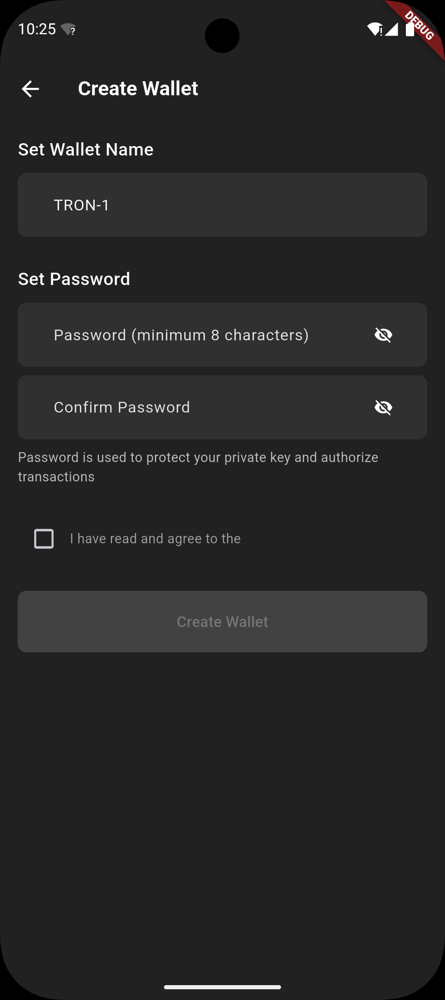
  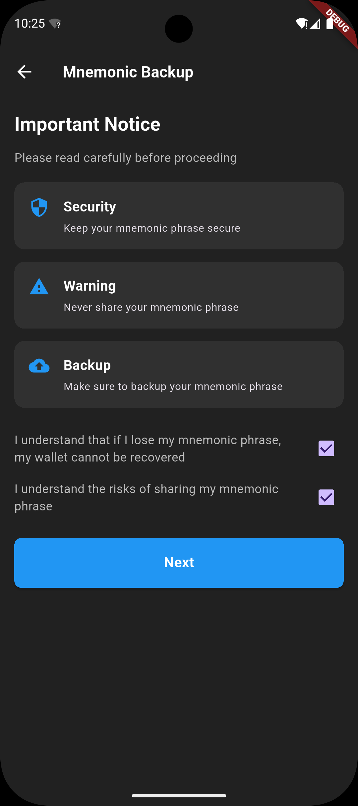
  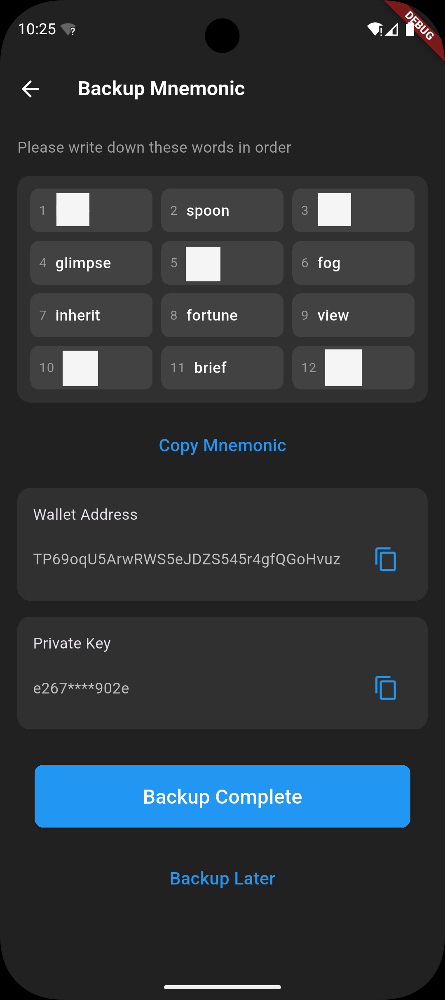
</div>

<div style="display: flex; flex-wrap: wrap; gap: 10px;">
  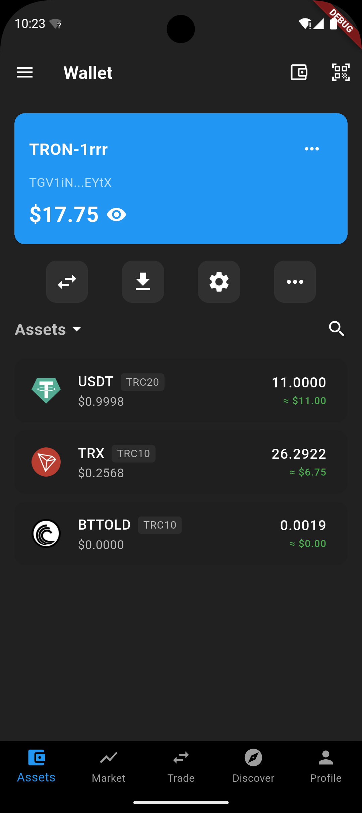
  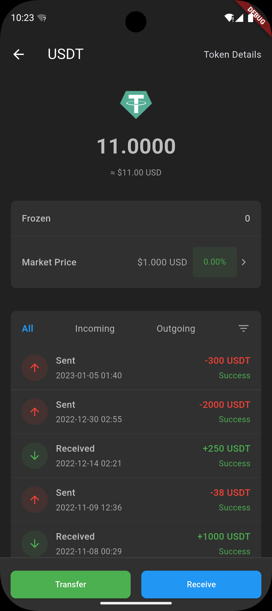
  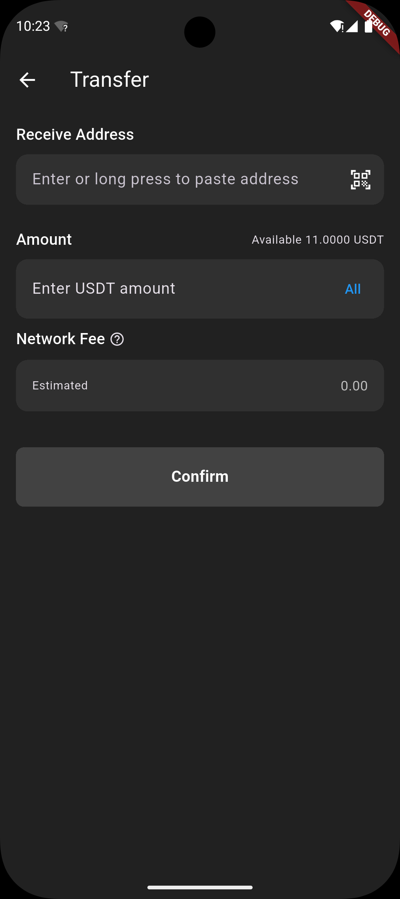
</div>

<div style="display: flex; flex-wrap: wrap; gap: 10px;">
  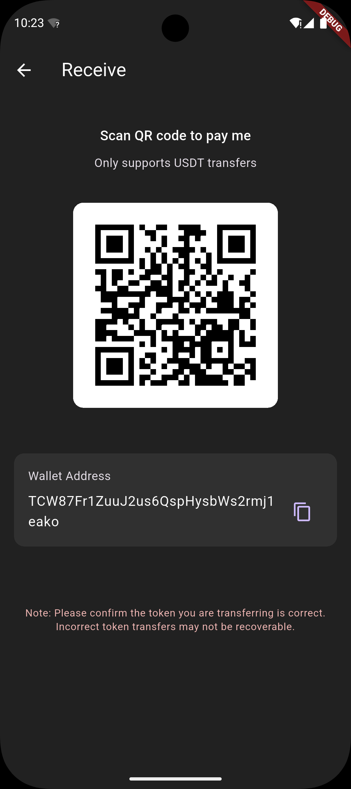
  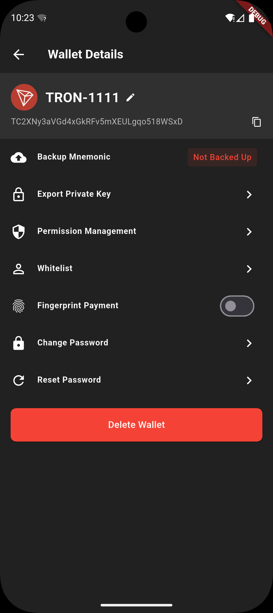
  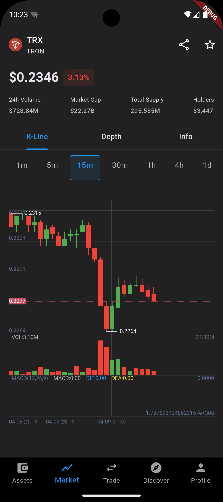
</div>

<div style="display: flex; flex-wrap: wrap; gap: 10px;">
  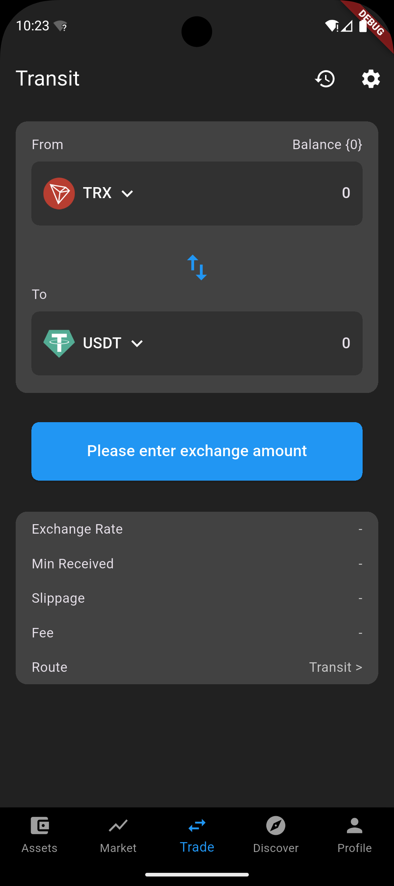
  
  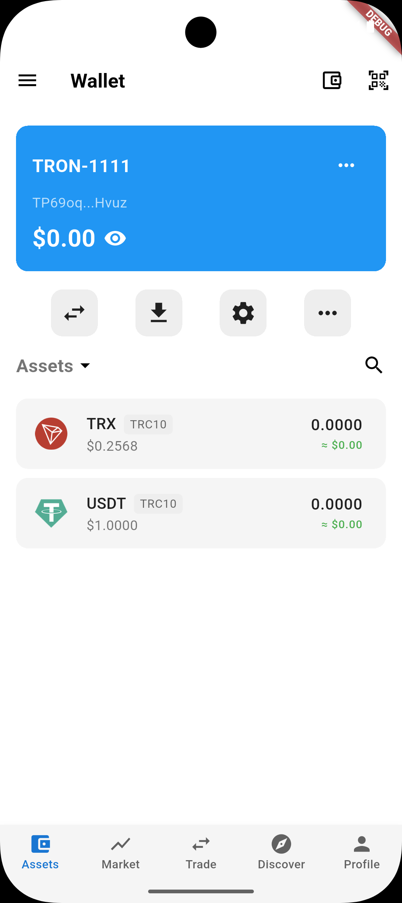
</div>


## ❤️ Support the Maintainer

This project is independently developed and maintained.

You can support ongoing development via:

**TRON (TRX / TRC20)**


`TRysLsvUqTUAyZN2pLMJjW95pYTNkGvrzM`

**Ethereum (ETH / ERC20)**


`0x0e6C46f49F4c3Bd90a855Ce18396Ee9666003146`

Thank you for supporting open infrastructure.
